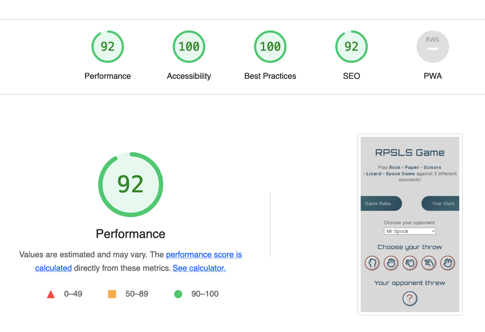

# RPSLS Game Project

[RPSLS Game](https://kurkrogi.github.io/RPSLS-game/) allows user to play Rock-Paper-Scisors-Lizard-Spock game agains 3 different opponents. Each of them employs different strategy to win. Mr Spock analyses previous player throws and plays against the most frequent one, Dr. Sheldon always throws "Spock", and Prof. Randomius plays a random throw. The source of random numbers is [Random.org](https://www.random.org/) and only if their API is unavailable a random number is generated by the game script.

## Features

### **Game Navigation**
Navigation between game screens allows acces to a panel with game rules and a screen featuring previous games outcomes.

### **Opponent Selection**
The user can select the type of opponent to play against with a menu.

### **Game Controls**
The game is played by clicking or tapping on one of the icons representing game throws. The outcome is displayed in a form of the icon showing opponent's throw and a box explaining the outcome also appears below.

### **Game Rules Screen**
This screens explains to the user what are rules of the game and features a list of wonning outcomes and a diagram depicting the same if visual form.

### **Game Statistics Screen**
This feature allows the user to see what are his statistics: how many games he or she won agains each opponent and what was his/hers winning hands. This is presented as a chart drawn with Google Charts API.

The data for both charts is stored in browser's local storage. The second chart is selectable by user and it's legend is dynamicaly generated to only show relevant elements.

## **Testing**

I tested the website in Firefox, Safari, Chrome and Edge browsers. Both responsiveness and integrity of the layouts were checked. The website worked in all four browsers without any problems.

I confirmed that all texts a legible in both on mobile and desktop computers. 

### Bugs
There are no known bugs.

### **Validation**

#### **HTML, CSS & JS**
All pages were tested with appropriate validators:

- [Markup validator](https://validator.w3.org/#validate_by_input)
- [CSS validator](https://jigsaw.w3.org/css-validator/#validate_by_input)
- [JS JSHint validator](https://jshint.com/)

All test passed without errors.

#### **Accessibility**

Accessibility was tested with the Chrome's Lighthouse extension in Firefox and high scores were achieved.

## **Deployment**

To deploy this application on GitHub pages please follow these steps:

1. In the GitHub repository click `Settings`
2. On the list on the left click `Pages`
3. Select the `main` branch and press the `Save` button
4. Refresh the page and follow the link after words **Your site is live at**

## **Credits**
- The colour palette was created with [Coolors](coolors.co)
- Fonts used: Inter Tight and Orbitron from [Google Fonts](https://fonts.google.com/)
- [Font Awesome](https://fontawesome.com/) icons were used for game buttons, game outcom display and second chart legend. 

## **Media**
The diagram on game rules screen was drawn by the author.
